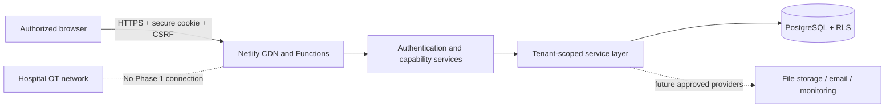

# Architecture overview

PneuNexus Ops is a Vite/React SPA with TanStack Router/Query. Netlify Functions form the trusted API boundary. Business services depend on provider contracts for authentication, PostgreSQL/Drizzle access, file storage, email, append-only auditing, and monitoring.

The client never supplies the authoritative organization. The session resolves user, organization, membership, role, capabilities, and facility assignments. Services combine organization predicates, facility checks, explicit capabilities, field-level redaction, UUIDs, and PostgreSQL RLS. Unauthorized object access uses resource-not-found semantics where appropriate.

### Trust boundaries

The browser is untrusted. Netlify Functions validate all input with Zod and authorize each protected operation. PostgreSQL is trusted only through least-privileged roles and parameterized Drizzle queries. No hospital OT endpoint is trusted or reachable in Phase 1.

### Reliability

Important records are archived rather than normally deleted. Device writes use optimistic-version columns for subsequent update endpoints. The architecture calls for transactions, idempotency keys, retry-safe jobs, correlation IDs, structured logs, health checks, monitoring, backups, and restoration tests as workflows expand.
