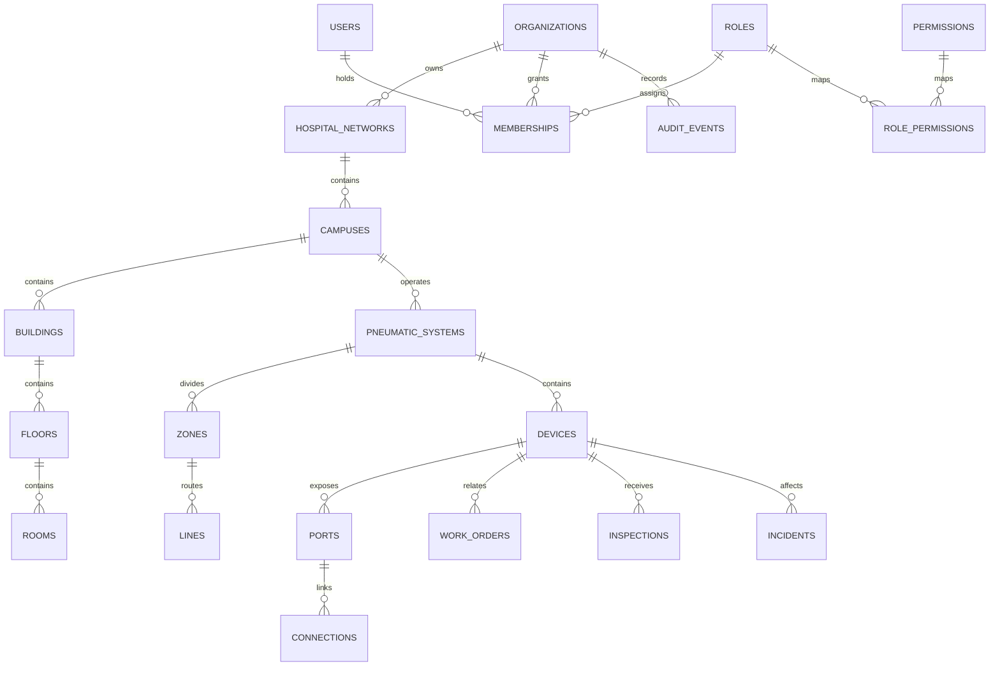

# Database model

The migration creates 43 normalized tables. All tenant-owned rows have `organization_id`; public IDs are UUIDs. Database constraints prevent duplicate facility asset tags, duplicate device port names, and duplicate source/destination port assignments. Important operational history uses archive timestamps and audit rows are protected by update/delete rejection triggers.
